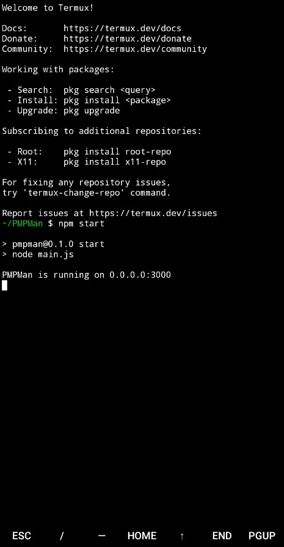
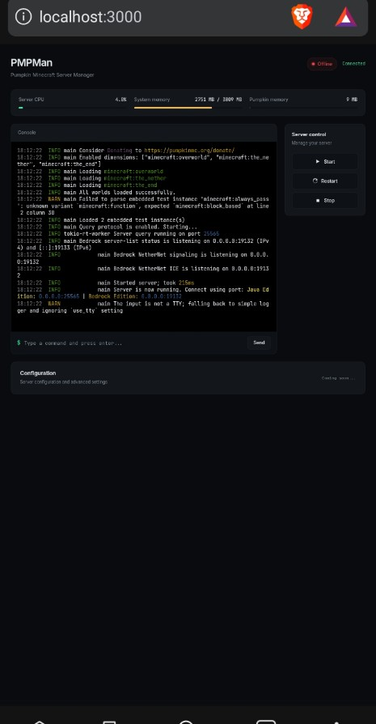

# Introduction
PMPMan is a simple Pumpkin Minecraft Server Pterodactyl-like manager

This Project is focused on Pumpkin Server only and did not guarantee it runs normally with a different server binary.

Pumpkin Repository:
https://github.com/Pumpkin-MC/Pumpkin

### NOTE: This Project is still on heavy development and still contains bug.

# How To Use
1. Clone this repository:
```bash
git clone https://github.com/NearOOM/PMPMan.git
```
2. Run the installer:
```bash
./install.sh
```
3. Run the manager(this also automaticly run the pumpkin binary):
```bash
npm start
```
or
```bash
node main.js
```

# Progress
### Main:
- [x] Backend(sendCommand)
- [ ] Web UI(not entirely made by hand)

### Integration:
- [x] Playit
- [x] Other Minecraft Server Builds(Paper, Vanilla, etc.)

# Suggestions
Just send them in the issues.

format:
- idea
- does it possible?
- is it difficult to make?

Difficult suggestions are not guaranteed to be carried out completely or even not carried out at all

# Screenshots
1. Ran PMPMan on termux

2. The manager UI



# Contribute
Feel free to contribute😁..
and i didn't have any rules on contribute yet so...

# License
GPLv3


### apology
 Sorry for bad README writing cuz im new on github and im trying my best😅..